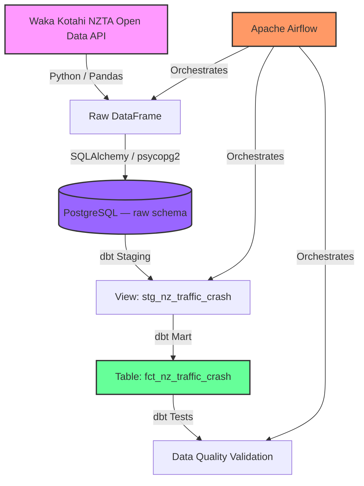

# NZ Traffic Crash Data Pipeline

An end-to-end data engineering pipeline that ingests, loads, transforms, and tests public traffic crash data from the **Waka Kotahi NZ Transport Agency Open Data Portal**.

Built to demonstrate production-grade data engineering patterns: containerised infrastructure, programmatic data ingestion, schema-aware database design, layered dbt transformation modelling, custom data quality testing, and Airflow orchestration — all running locally via Docker Compose.

---

## Architecture & Data Flow



| Stage | Tool | Description |
|---|---|---|
| **Extract** | Python, Pandas | Pulls crash data from the NZTA ArcGIS CSV endpoint and adds an ingestion timestamp |
| **Load** | SQLAlchemy, psycopg2 | Loads the raw DataFrame into PostgreSQL preserving original column casing |
| **Transform** | dbt Core | Builds a staging view (clean types, snake_case) and a mart fact table (derived metrics) |
| **Test** | dbt singular tests | Validates business logic across the mart layer |
| **Orchestrate** | Apache Airflow | Schedules the full pipeline daily with task-level dependency management |

---

## Tech Stack

| Layer | Technology |
|---|---|
| Orchestration | Apache Airflow 2.10 |
| Transformation | dbt Core 1.12+ |
| Database | PostgreSQL 18 |
| Ingestion | Python 3, Pandas, SQLAlchemy |
| Containerisation | Docker, Docker Compose |

---

## Project Structure

```
├── dags/
│   └── NZCrash_pipeline_dag.py      # Airflow DAG — extract/load → dbt run → dbt test
├── extract/
│   ├── NZTrafficCrash_extract.py    # Pulls raw NZTA data from the open API
│   └── main.py                      # Extraction entrypoint
├── load/
│   ├── postgres_load.py             # Loads DataFrame into Postgres raw schema
│   └── main.py                      # Load entrypoint
├── dbt/NZCrashData/
│   ├── models/
│   │   ├── sources.yml              # Source definitions and column documentation
│   │   ├── staging/
│   │   │   └── stg_nz_traffic_crash.sql
│   │   └── marts/
│   │       └── fct_nz_traffic_crash.sql
│   ├── tests/                       # Custom singular dbt data quality tests
│   ├── dbt_project.yml
│   └── profiles.yml                 # Connection config (reads from environment variables)
├── docker-compose.yml               # PostgreSQL + Airflow (init, webserver, scheduler)
├── requirements.txt
└── .env                             # Not committed — see Environment Variables below
```

---

## dbt Data Modelling

### Staging Layer — `stg_nz_traffic_crash` (View)

Cleans and standardises the raw source table:

- Renames all columns from camelCase / UPPERCASE to `snake_case`
- Wraps mixed-case source columns in double quotes to handle Postgres case sensitivity
- Safe-casts all numeric columns using regex guards, defaulting to `0` or `NULL` rather than erroring
- Handles coordinates (`X`, `Y`) as decimals with NULL for invalid values
- Adds `ingested_at` via `{{ current_timestamp() }}`

### Mart Layer — `fct_nz_traffic_crash` (Table)

Builds the analytical fact table with derived business metrics:

| Column | Description |
|---|---|
| `road_type` | Categorises speed limit into `Urban` (≤50), `Rural` (≤80), `Highway` (>80), or `Unknown` |
| `total_casualties` | Sum of fatal, serious, and minor injury counts |
| `has_fatality` | Boolean — true when `fatal_count > 0` |
| `involves_vulnerable_road_user` | Boolean — true when any bicycle, moped, or motorcycle count > 0 |
| `is_serious_or_fatal` | Boolean — true when serious or fatal injuries occurred |
| `holiday_name` | Null-safe — defaults to `'No Holiday'` when null |

---

## Data Quality Tests

Five custom singular tests validate business logic against the mart:

| Test | What it checks |
|---|---|
| `assert_fct_nz_traffic_crash_fatalityCheck` | `has_fatality` is `true` whenever `fatal_count > 0` |
| `assert_fct_nz_traffic_crash_checkSeriousOrFatel` | `is_serious_or_fatal` is not `true` when both `serious_injury_count` and `fatal_count` are 0 |
| `assert_fct_nz_traffic_crash_validTotalcasualties` | `total_casualties` is never negative |
| `assert_fct_nz_traffic_crash_roadType` | `road_type` is always one of the four expected values |
| `assert_fct_nz_traffic_crash_yearNotInFuture` | `crash_year` does not exceed the current year |

---

## Airflow DAG

The `NZTrafficCrash_pipeline` DAG runs daily (`@daily`, no catchup) with three sequential tasks:

```
extract_and_load  →  dbt_run  →  dbt_test
```

- **`extract_and_load`** — PythonOperator that calls the extract and load functions
- **`dbt_run`** — BashOperator running `dbt run` inside the Airflow container
- **`dbt_test`** — BashOperator running `dbt test` after a successful build

---

## Environment Variables

Create a `.env` file in the project root (not committed):

```env
POSTGRES_PASSWORD=your_password
POSTGRES_DATABASE_NAME=NZTrafficCrashData

AIR_FLOW_USER=admin
AIR_FLOW_PASSWORD=admin
AIR_FLOW_FIRSTNAME=First
AIR_FLOW_LASTNAME=Last
AIR_FLOW_EMAIL=admin@example.com
```

> **Note:** PostgreSQL 18 requires the volume path to include a version suffix: `/var/lib/postgresql/data/18`. This is already configured in `docker-compose.yml`.

---

## How to Run

### Prerequisites

- Docker and Docker Compose
- Python 3.10+

### 1. Configure environment

```bash
cp .env.example .env  # then fill in your values
```

### 2. Start infrastructure

```bash
docker compose up -d
```

This starts PostgreSQL and the full Airflow stack (init, webserver, scheduler). Airflow initialises the metadata database before the webserver and scheduler start.

### 3. Run the pipeline manually (without Airflow)

```bash
python -m venv venv
source venv/bin/activate       # macOS/Linux
# venv\Scripts\activate        # Windows

pip install -r requirements.txt
python -m load.main
```

### 4. Run dbt transformations and tests

```bash
cd dbt/NZCrashData
dbt build --profiles-dir .
```

### 5. Trigger via Airflow

Navigate to `http://localhost:8080`, log in with your configured credentials, enable the `NZTrafficCrash_pipeline` DAG, and trigger a run.

---

## Data Source

**Waka Kotahi NZ Transport Agency — Crash Analysis System (CAS)**

- Portal: [NZTA Open Data Portal](https://opendata-nzta.opendata.arcgis.com/)
- Licence: Creative Commons Attribution 4.0 International
- Coverage: All recorded road crashes in New Zealand
