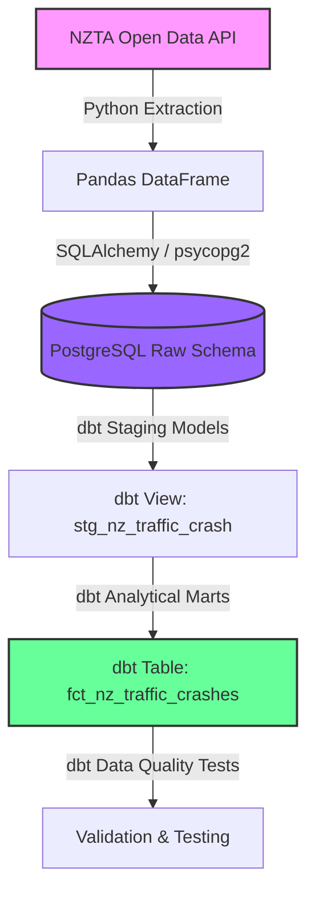

# NZ Traffic Crash Data Engineering Pipeline

An end-to-end Modern Data Stack (MDS) data pipeline designed to ingest, load, transform, and test public traffic crash data from the **Waka Kotahi NZ Transport Agency Open Data Portal**. 

This repository showcases production-grade data engineering patterns: containerized infrastructure, programmatic ingestion, case-sensitive database schema design, dbt-based transformation modeling, and robust data quality assurance.

---

## 🏗️ Architecture & Data Flow



1. **Ingest (E):** Programmatic retrieval of CSV data from the NZTA API, injecting ingestion timestamps for full data auditability.
2. **Load (L):** Loading raw, case-sensitive columns into a PostgreSQL `raw` schema using Python, SQLAlchemy, and `psycopg2-binary`.
3. **Transform (T):** Building structured staging and mart analytical layers with dbt Core.
4. **Orchestrate (O):** Workflow scheduling and dependency mapping using Apache Airflow.

---

## 🛠️ Tech Stack

*   **Orchestration:** Apache Airflow
*   **Data Transformation:** dbt Core (v1.12+)
*   **Database:** PostgreSQL (v18)
*   **Languages & Tools:** Python (Pandas, SQLAlchemy, Psycopg2), SQL
*   **Containerization:** Docker & Docker Compose

---

## 🗂️ Project Structure

```
├── dags/                          # Apache Airflow DAG definitions
│   └── crypto_pipline_dag.py      # Orchestrates extract-load & dbt run-test tasks
├── extract/                       # Ingestion scripts
│   ├── NZTrafficCrash_extract.py  # Pulls raw NZTA data from open API
│   └── main.py                    # Extraction entrypoint
├── load/                          # Database loading scripts
│   ├── postgres_load.py           # Loads DataFrames to Postgres (keeps raw casing)
│   └── main.py                    # Load entrypoint
├── dbt/NZCrashData/               # dbt project directory
│   ├── models/
│   │   ├── sources.yml            # Source schemas & documentation
│   │   ├── staging/               # Staging models (clean/cast/standardize)
│   │   └── marts/                 # Analytical dimensions & facts
│   ├── tests/                     # dbt Singular Data Quality Tests
│   ├── dbt_project.yml            # dbt configuration
│   └── profiles.yml               # Database connection profiles
├── docker-compose.yml             # Docker multi-container services definition
└── requirements.txt               # Python package dependencies
```

---

## 📊 dbt Data Modeling

### 1. Staging Layer (`stg_nz_traffic_crash`)
*   **Purpose:** Standardizes raw columns, handles case-sensitive mappings, cleans geospatial coordinates, and casts types.
*   **Logic:** Standardizes camelCase and UPPERCASE system columns (e.g. `OBJECTID`, `tlaId`, `NumberOfLanes`) into clean snake_case variables.

### 2. Marts Layer (`fct_nz_traffic_crashes`)
*   **Purpose:** Enriches raw metrics to build a single source of truth fact table for reporting.
*   **Derived Columns:**
    *   `total_injured_count` (serious + minor injury counts)
    *   `total_casualties` (serious + minor + fatal counts)
    *   `has_fatalities` (boolean flag based on fatalities)
    *   `speed_zone` (categorizes speeds into `Urban`, `Suburban/Rural`, or `Highway/Open Road`)

---

## 🧪 Data Quality & Validation

We implement a multi-layered testing strategy combining schema-level constraints and custom singular business logic tests:

*   **Schema Tests (`schema.yml`):**
    *   `unique` and `not_null` constraints on primary keys (`crash_id`).
    *   `not_null` validation on vital dimensions like `crash_severity`, `speed_zone`, and calculated metrics.
*   **Singular Business Logic Tests (`/tests`):**
    *   `assert_total_casualties_match_sum`: Validates that computed total casualties equal the sum of fatal, serious, and minor injuries.
    *   `assert_injury_counts_are_positive`: Ensures no raw or processed record contains negative injury counts.
    *   `assert_has_fatalities_flag_is_correct`: Guarantees logical alignment between boolean indicators and casualty numbers.

---

## 🚀 How to Set Up and Run

### Prerequisites
*   Docker & Docker Compose
*   Python 3.10+

### 1. Start Infrastructure
Launch the PostgreSQL database service:
```bash
docker compose up -d postgresSQL
```

### 2. Install Python Dependencies
Create and activate your virtual environment, then install requirements:
```bash
python -m venv venv
venv\Scripts\activate  # Windows
source venv/bin/activate  # macOS/Linux

pip install -r requirements.txt
```

### 3. Extract & Load Raw Data
Run the ETL entrypoint to extract from NZTA Open API and load into the PostgreSQL `raw` schema:
```bash
python -m load.main
```

### 4. Run dbt Transformations & Tests
Navigate to the dbt project folder and execute the compilation, build, and test steps:
```bash
cd dbt/NZCrashData

# Run models and tests
dbt build
```
